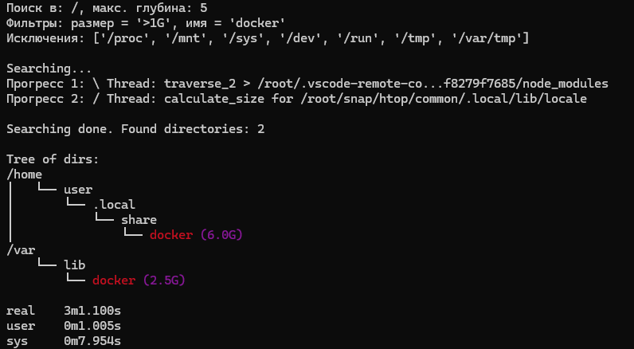
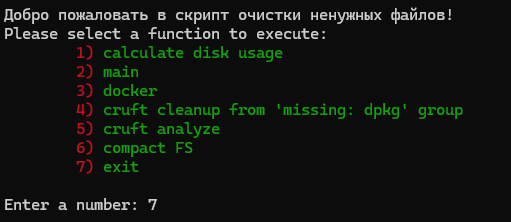

# Cleaner for Ubuntu

- [find](find.py) - function to find by:
    - name
    - size
  
  Features:
  + Displays results as a directory tree in the terminal
  + Logs output in JSON format
  + Multithreaded execution
  + Dual progress bar display
    
    

  Arguments:
  - **path** -- root dir to begin search
  - **max_depth** -- max search depth (recursion level)
  - **size_filter** -- size filter (e.g., '>2G'  for files larger than 2GB)
  - **name_filter** -- directory name pattern filter
  - **exclude_dirs** -- list of directories to exclude from search
- [freeup](freeup.sh) - function to clean up system.
  
  Features:
  + Interactive menu for action selection

    
  + calculating disk usage (before cleanup to compare a result)
  + cleaning up space used by docker
  + `cruft` tool to get unnecessary files (not included in packages)
  + compact FS (defragmentation)

## TODO

- [ ] full translate to mono language
- [ ] add selection to choose the interface language
- [ ] add a menu item: "searching (by name, size, place)"
- [ ] add run find.py before and after docker cleanup
- [ ] add `cruft` installation
